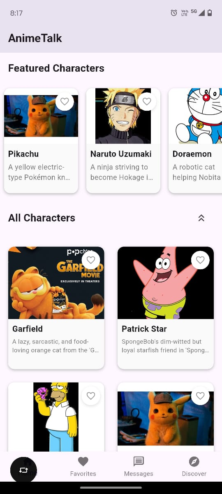

# AnimeTalk

AnimeTalk is a Flutter-based mobile application designed for anime enthusiasts to connect, discuss, and share their passion for anime. This platform provides a seamless experience for users to engage in conversations about their favorite anime series, characters, and more.

## Features

- **User Authentication**: Secure login and registration system
- **Discussion Forums**: Dedicated spaces for different anime genres and series
- **Real-time Chat**: Connect with other anime fans instantly
- **Personalized Recommendations**: Discover new anime based on your preferences
- **Profile Customization**: Create a unique profile representing your anime interests
- **Notifications**: Stay updated with the latest discussions and mentions

## Technologies Used

- Flutter for cross-platform mobile application development
- Dynamodb for storage
- AWS Lambda function for running backend application
- S3 Bucker for stroing images


## Getting Started

### Prerequisites

- Flutter (latest version)
- Dart SDK
- Android Studio or VS Code
- Git

### Installation

1. Clone the repository:

```bash
git clone https://github.com/yourusername/animetalk.git
```

2. Navigate to the project directory:

```bash
cd animetalk
```

3. Install dependencies:

```bash
flutter pub get
```

4. Run the application:

```bash
flutter run
```

## Usage

After launching the application, you can:

1. Create a new account or log in with existing credentials
2. Explore discussion forums based on different anime categories
3. Join conversations and share your thoughts
4. Customize your profile to showcase your favorite anime
5. Connect with other users through the chat feature

## Sample

[]

[]

## Contributing

We welcome contributions to AnimeTalk! Please follow these steps:

1. Fork the repository
2. Create a new branch (`git checkout -b feature/your-feature`)
3. Commit your changes (`git commit -m 'Add some feature'`)
4. Push to the branch (`git push origin feature/your-feature`)
5. Open a Pull Request

---

_Note: AnimeTalk is a fictional project created for demonstration purposes._
